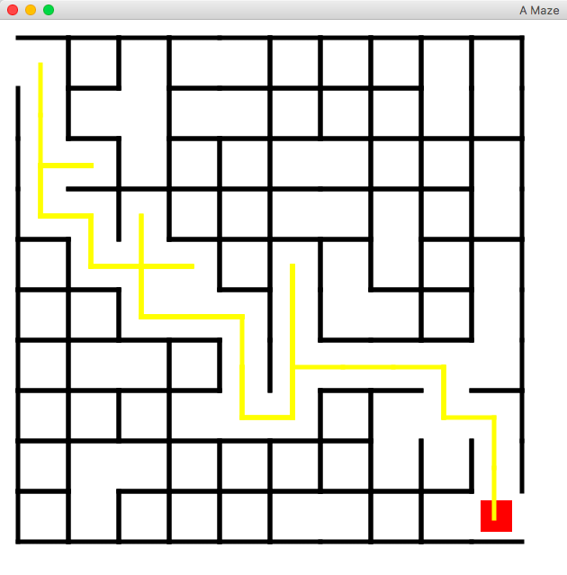

# Java-Maze
## Object Oriented Design - Fall 2019

A maze implementation in Java. Created by Atalay Kutlay, Timon Braun, Tyrell Daniels, and Jacob Adkinds. It includes two approaches to create a maze and two approaches to solve a maze. 

Creating approaches :
	- BFSGenerator (Jacob Adkinds)

	- HallwayGenerator (Timon Braun)

Solving approaches :
	- RandomPathFinder (Atalay Kutlay)

	- StayRightPathFinder (Tyrell Daniels)
	

# Documentation
### Classes : 

- BFSGenerator
- DFSGenerator
- DirType
- HallwayGenerator
- Maze
- MazeAdapter
- MazeApplication
- MazeDisplayGraphics
- MazeGenerator
- MazeMonster
- PathFinder
- RandomPathFinder
- RectMaze
- Square
- Thing
